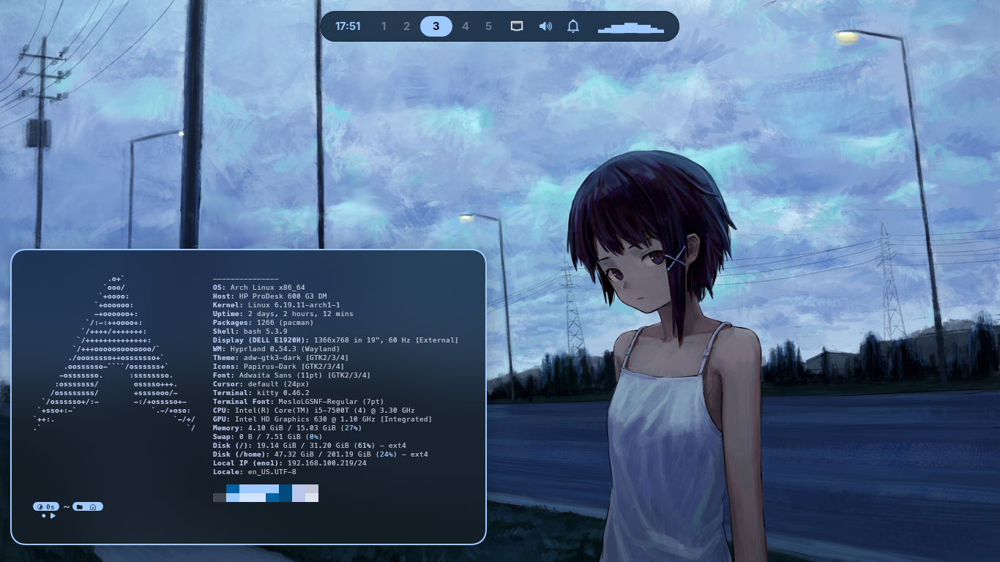

# 🧊 Hyprland Dotfiles

Minimal and clean **Hyprland** setup for Arch Linux, focused on performance, aesthetics, and dynamic theming with **Matugen**.



---

## ✨ Features

- ⚡ Minimal Hyprland configuration
- 🎨 Dynamic colors with Matugen
- 🧱 Modular config structure
- 🔔 Notifications with SwayNC
- 📊 Waybar with custom scripts
- 🖼️ Wallpaper selector script
- 🔒 Hyprlock integration

---

## 📦 Requirements

Before installing, make sure you have:

- A **clean Arch Linux installation**
- An **AUR helper (yay)** installed

### 🧱 Clean installation

```bash
pacman -S base base-devel linux linux-firmware efibootmgr grub intel-ucode sudo zram-generator cpupower power-profiles-daemon intel-media-driver libva-intel-driver vulkan-intel lib32-vulkan-intel xorg-server xorg-xinit xdg-user-dirs pipewire pipewire-alsa pipewire-jack pipewire-pulse wireplumber libpulse pamixer pavucontrol gst-plugin-pipewire gst-plugins-bad gst-plugins-base gst-plugins-good gst-plugins-ugly networkmanager ufw bash-completion neovim git python-gobject gvfs-mtp
```

### Install yay (if needed)

```bash
sudo pacman -S --needed git base-devel
git clone https://aur.archlinux.org/yay-bin.git
cd yay-bin
makepkg -si
```

---

## 🚀 Installation

Clone the repository:

```bash
git clone https://github.com/kendo99k/HyprKendo.git
cd HyprKendo
```

🧰 CLI

```bash
sudo pacman -S --needed btop htop fastfetch unrar unzip kitty mpv imagemagick
```

🌐 Fonts

```bash
sudo pacman -S --needed adobe-source-han-sans-cn-fonts adobe-source-han-sans-jp-fonts adobe-source-han-sans-kr-fonts awesome-terminal-fonts cantarell-fonts noto-fonts noto-fonts-cjk noto-fonts-emoji opendesktop-fonts ttf-bitstream-vera ttf-dejavu ttf-liberation ttf-meslo-nerd ttf-opensans
```

🪟 Hyprland

```bash
sudo pacman -S --needed xorg-xwayland xdg-desktop-portal-hyprland xdg-dbus-proxy hyprland hyprlock hyprpicker hyprpolkitagent hyprshot rofi waybar grim slurp swappy swaylock swaync wtype
```

🧩 Qt & GTK

```bash
sudo pacman -S --needed qt5-wayland qt6-wayland sddm polkit-kde-agent breeze breeze-icons breeze5 dolphin breeze-gtk adw-gtk-theme papirus-icon-theme nautilus loupe polkit-gnome
```

🎨 Ricing
```bash
sudo pacman -S --needed cava eza starship awww network-manager-applet nwg-look matugen 
```

AUR packages:

```bash
yay -S --needed wlogout papirus-folders vscodium-bin vscodium-bin-marketplace
```
---

## ⚙️ Copy the dotfiles (manual)

### 📁 Create required directories

```bash
mkdir -p ~/.config
mkdir -p ~/.local/bin
```
---

### 📦 Copy main files

```bash
cp -r .bashrc ~/.bashrc
cp -r .gtkrc-2.0 ~/.gtkrc-2.0
cp -r wallpapers ~/wallpapers
```
---

### ⚙️ Copy config files

```bash
cp -r .config/* ~/.config/
```
---

### 🧰 Copy local scripts

```bash
cp -r .local/bin/* ~/.local/bin/
```
---

## 🎨 Theming (Matugen)

This setup uses **Matugen** for dynamic color generation.

- Templates are located in:
  ```
  ~/.config/matugen/templates/
  ```
- Generated colors:
  ```
  ~/.config/matugen/colors/
  ```
- Wallpapers are located in: 
  ```
  ~/wallpapers
  ```
- Select Wallpaper:

```bash
select-wallpaper
```
---

Includes support for:
- GTK3 / GTK4
- SwayNC
- Rofi
- Waybar
- Qt

---

## 🛠️ Customization

Edit configs in:

```
~/.config/
```

Main areas:
- `hypr/` → window manager
- `waybar/` → status bar
- `rofi/` → launcher
- `matugen/` → colors
- `swaync/` → notifications

---

## 📜 License

This project is open-source. Use and modify freely.
